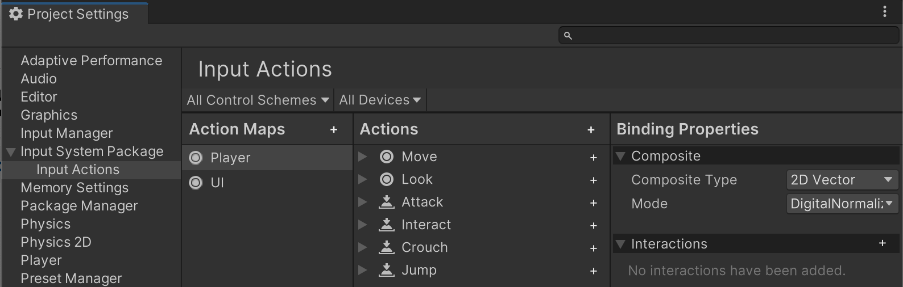

# Quickstart Guide

**Note**: For information on how to install the new Input System, see [Installation](Installation).

The quickest way to get started using the Input System after installing in your project is to read values using the `InputActions` class from the default input settings that are pre-configured when you install the Input System package in your project.

## Read values from the default input settings

The default actions are set up to match common app and game scenarios, and are configured to read most types of input controller: Keyboard, Mouse, Gamepad, Touchscreen and XR.

For instance, you can read the default 2D "Move" axis and "Jump" button from the default "Player" action map, using a single line of code for each:

```
    // read the default "move" action, which is a 2D vector axis
    Vector2 move = InputActions.player.move.value;

    // read the default "jump" action, which is a true/false button
    bool jump = InputActions.player.jump.isPressed;
```

These lines of code work straight away with no configuration required because they match the names of the pre-configured defaults in the Input System package.

**Note**: Different types of action have different methods to access their value, which is why you see `.value` used to read a 2D axis, and `.isPressed` to read a button state, in the example above. 

## The default Action Maps and Actions

There are two default Action Maps: "Player" and "UI". These each contain default actions that are typically useful for gameplay and user interface interactions.

The "Player" action map defines several game-related actions such as "Move", "Look", "Jump" and "Attack" actions. The "UI" action map defines several user-interface-related actions such as "Navigate", "Submit" and "Cancel".

 Each each default action has bindings to several different types of Control. For example:

- The "move" action is bound to the "WSAD" keyboard keys and arrow keys, a gamepad stick, the primary 2D axis on an XR controller
- The "jump" action is bound to the space key, the "south" button on a gamepad, and the secondary button on an XR controller.

## View and edit the default input settings

The **Input Actions Settings window** allows you to view and edit the default input settings. Open the  Input Actions Settings window by going to **Edit** > **Project Settings** > **Input System Package** > **Input Actions**.



## The dynamic `InputActions` class

The names of the Action Maps and Actions defined in the Input Actions Settings window directly control the API members that are available on the `InputActions` class.

When you add, modify, or delete Action Map names, or Action names, those API members are added, modified, or deleted from the `InputActions` class.

For example, if you define a new Action in the *"Player"* action map called *"Drop"*, the API `InputActions.player.drop` becomes available.

Similarly, if you rename an Action or Action Map whose corresponding API you have used in your code, you must update your code to match the new name.

**Note:** Because you can use names that contain characters which are not permitted in C# API names, the API names may differ slightly. For example, an Action in the *"Player"* Action Map called *"Jump Higher!!"* results in the API member: `InputActions.player.jumphigher`.


