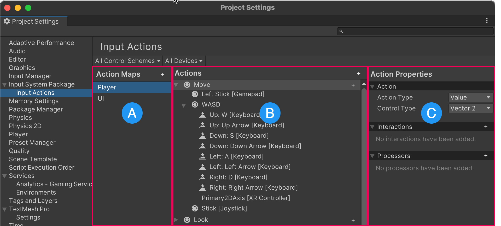

# Workflow Overview - Project Wide Actions

While the Input System has a variety of workflows to choose from, the primary recommended workflow for using the Input System is to use the [**Input Actions** editor](InputActionsEditor.md) in the **Project Settings window** to configure your project-wide Actions and Bindings, and then read the values for those actions in your code using the `InputActions` class.

**Note**: *Previous versions of the input package used a different workflow which required creating an "Input Action Asset". While that is still possible, it is no longer necessary because you can define actions in the Project settings window and access them directly from your scripts.*

Open the Input Actions editor by going to **Edit** > **Project Settings** > **Input System Package** > **Input Actions**


*The Input Actions editor in the Project Settings window*

The Input Actions editor provides a way to define and manage Action Maps, Actions, and Action Properties which relate to what you want users to be able to do in your game or app.

[**Actions**](Actions.md) are high level concepts that describe individual things that a user might want to do - such as move, look, or jump within a game, or navigate an on-screen UI.

[**Action Maps**](ActionAssets.html#editing-action-maps) are a way to organise Actions into logical groups, which represent specific situations in which a set of actions make sense. For example, your game might involve driving vehicles and navigating on foot, and may have in-game menus. In this example, it would make sense to have three different action maps for each of these three situations, and your game code would switch between them as appropriate. The actions grouped into the "driving" action map might be called "steer", "accelerate", "brake", "handbrake", etc, whereas the actions grouped into the "on foot" action map might be "move", "jump", "crouch", "use", etc.

**Action Properties** define tye type of input that relates to the action, such as whether it is a button, or an axis.

[**Control Schemes**](ActionAssets.html#editing-control-schemes) refer to particular modes of input, such as "Joypad" or "Keyboard and Mouse". You can specify which bindings belong to particular control schemes. You might have one control scheme which is "Joypad", and another control scheme which is "Keyboard and Mouse". This allows you to determine which control scheme the user is currently using, so your game can respond to the user accordingly. This feature is often used to adapt the in-game UI to show the correct keys or buttons in on-screen prompts.

The Input Actions editor allows you to create Actions, and then bind them to one or more types of control on various devices, such as a stick on a gamepad, a key on a keyboard, or a button on an XR controller.

Using Actions (as opposed to [directly reading device states](Workflow-Direct.html) from your scripts) allows you to separate these definitions from your code, providing a layer of abstraction between your code and the specific devices and controls which cause your code to be executed.


## Accessing your Actions Asset from code

When you use an Actions Asset, there are two distinct ways to access it from your code. You can either:

* Use an **inspector reference** to the Actions Asset, or
* Generate a **C# class** that wraps your Actions Asset.

Your choice affects how you access your actions from code. With an **inspector reference** to your Actions Asset, you must read the actions by name using strings. If you use the **Generate C# class** feature, Unity generates an accompanying class as a new **.cs** script asset, which acts as a wrapper for your actions. You can then create an instance of the generated wrapper class in your code and directly use its API members which are named after the names of the actions that you configured.

Both workflow options are described below using the same example, so you can see the difference.

### Referencing the Actions Asset in the inspector

To use your Actions Asset through an **inspector reference**:

1. Create a `public InputActionsAsset` field in your script.
2. [Assign the reference](https://docs.unity3d.com/Manual/EditingValueProperties.html#ref-assign-dnd) in the inspector.
3. Access the Actions in your script by name, using strings.

This string-based access is demonstrated in the example below.

```
using UnityEngine;
using UnityEngine.InputSystem;

public class ExampleScript : MonoBehaviour
{
    // assign the actions asset to this field in the inspector:
    public InputActionAsset actions;

    // private field to store move action reference
    private InputAction moveAction;

    void Awake()
    {
        // find the "move" action, and keep the reference to it, for use in Update
        moveAction = actions.FindActionMap("gameplay").FindAction("move");

        // for the "jump" action, we add a callback method for when it is performed
        actions.FindActionMap("gameplay").FindAction("jump").performed += OnJump;
    }

    void Update()
    {
        // our update loop polls the "move" action value each frame
        Vector2 moveVector = moveAction.ReadValue<Vector2>();
    }

    private void OnJump(InputAction.CallbackContext context)
    {
        // this is the "jump" action callback method
        Debug.Log("Jump!");
    }

    void OnEnable()
    {
        actions.FindActionMap("gameplay").Enable();
    }
    void OnDisable()
    {
        actions.FindActionMap("gameplay").Disable();
    }
}
```

**Note:** In the example above the reference to the "move" action is stored in a variable after it is found, to avoid accessing it by string every frame, which would be bad for performance.


### Referencing the Actions Asset through a C# wrapper

To use your Actions Asset through a **C# wrapper**:

1. Select your Actions Asset in the project window
2. In the Inspector, enable **Generate C# Class** and select **Apply**. You should see a C# asset with the same name as your Actions Asset in your project window.
3. Create an instance of your Actions C# class in your script.
3. Access the Actions in your script by using the API of your Actions C# class.

For example:

```
using UnityEngine;
using UnityEngine.InputSystem;

public class DocsExampleActionsAssetCsWrapper : MonoBehaviour
{
    // this field will contain the actions wrapper instance
    ExampleActions actions;

    void Awake()
    {
        // instantiate the actions wrapper class
        actions = new ExampleActions();

        // for the "jump" action, we add a callback method for when it is performed
        actions.gameplay.jump.performed += OnJump;
    }

    void Update()
    {
        // our update loop polls the "move" action value each frame
        Vector2 moveVector = actions.gameplay.move.ReadValue<Vector2>();
    }

    private void OnJump(InputAction.CallbackContext context)
    {
        // this is the "jump" action callback method
        Debug.Log("Jump!");
    }

    void OnEnable()
    {
        actions.gameplay.Enable();
    }
    void OnDisable()
    {
        actions.gameplay.Disable();
    }
}
```

Whether you use the C# wrapper option, or the inspector reference option, using an Action Asset like this gives you the ability to organize and edit your actions in the Actions Window. It is more flexible than using [embedded actions](Workflow-Embedded.html), and [directly reading device states](Workflow-Direct.html), and is generally a good solution for many projects. However, you can also add one more step of abstraction using the [Player Input component](Workflow-PlayerInput.html), to set up calls to methods based on your Action definitions.

>[!Note]
>Because Action Assets can be used in these two different ways (by reference, or by C# wrapper), the code samples used throughout this documentation also vary in which way they are written. Some code samples might use a reference and strings to identify actions, and others might use the C# wrapper method.

See also:

* [Using Action Assets](ActionAssets.html)

* [Generating a C# Class that wraps your actions](ActionAssets.html#auto-generating-script-code-for-actions)
